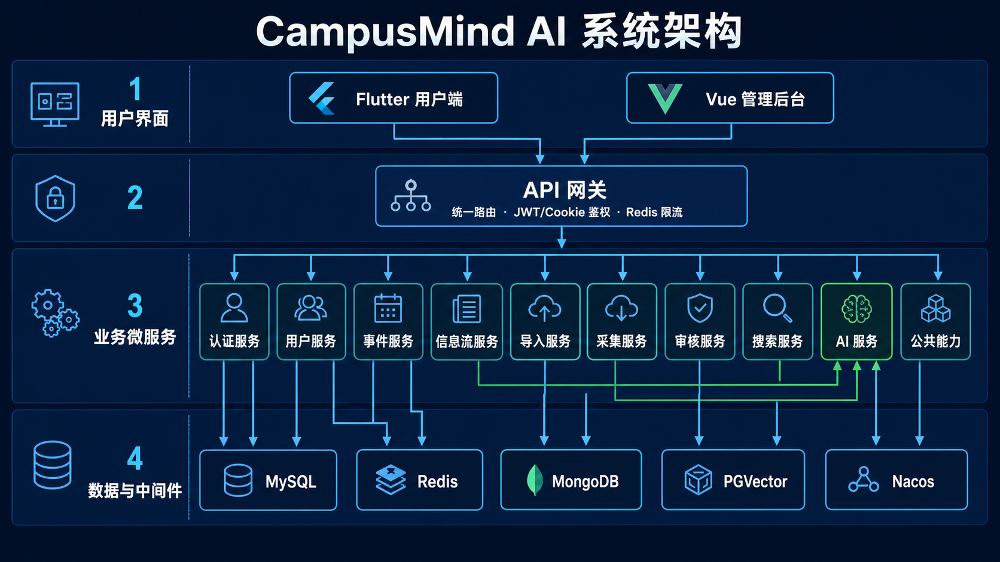

# CampusMind AI

CampusMind AI 是面向高校通知、课程、考试、作业、活动和校园服务的事件感知与信息聚合系统。系统覆盖多源采集、AI 抽取、人工审核、个性化分发、提醒、搜索和用户数据生命周期管理。

## 项目介绍

高校中的重要信息通常分散在学校官网、学院网站、教学平台、班级通知和临时文件中。不同来源的发布时间、表达方式和信息结构并不统一，学生需要反复查找并自行判断时间、地点、面向对象和待办事项，容易出现错过报名、考试、作业或活动的情况。管理人员也缺少统一的数据源巡检、内容审核、变更追踪和通知撤回工具。

CampusMind AI 将这些分散信息整理为统一的校园事件。系统从公开网页和用户提交内容中获取原始信息，通过规则或大模型抽取标题、事件类型、时间、地点、组织方、适用对象、标签和摘要，再经过自动校验与人工审核进入用户信息流。学生可以按个人画像、专业、年级和订阅来源查看内容，也可以搜索、收藏、生成待办并接收提醒。

项目面向三类使用者：

- 学生用户：集中查看与自己相关的校园信息，管理订阅、收藏、待办、提醒、个人画像和隐私授权。
- 学校或学院管理员：维护数据源、审核 AI 抽取结果、纠正或下线信息、查看采集任务、用户、日志和版本历史。
- 系统运维人员：配置认证、数据库、模型、通知和数据保留策略，并通过健康检查、审计记录和端到端测试验证运行状态。

系统形成以下业务链路：

```text
公开网页 / 用户导入 / 教学平台
              ↓
       采集、解析与原文留存
              ↓
     AI 结构化抽取与质量标记
              ↓
       管理员审核、修正、发布
              ↓
 个性化信息流 / 搜索 / 待办 / 提醒
              ↓
 变更通知、撤回、审计与数据生命周期
```

项目同时提供规则开发模式和真实 LLM + PGVector 模式。外部 AI 不可用时，接口和页面会明确标记降级状态；系统不会用演示数据或伪造摘要掩盖服务故障。账号、通知和数据源操作均保留可追踪状态，用户还可以查看授权记录、导出个人数据或注销账号。

## 系统架构



核心业务时序、信息审核活动、账号会话和角色用例见 [系统图集](docs/diagrams.md)。

## 核心功能

- 多源接入：公开网页、用户文本、图片、文件和雨课堂 JSON；一次性 Cookie 导入默认关闭。
- AI 处理：规则开发模式、OpenAI 兼容 ChatModel、中文 Transformer Embedding 和 PGVector。
- 信息治理：AI 状态、人工审核、修正、下线、来源追踪和完整审计日志。
- 数据源运营：新增、编辑、启停、增量采集、版本历史、基线快照和回滚。
- 用户端：个性化信息流、订阅、收藏、已读、待办、提醒、搜索、每日简报和 AI 助手。
- 通知闭环：设备注册、站内投递、Webhook 推送、去重、重试、投递记录和撤回。
- 账号安全：学生注册、密码找回、轮换 Refresh Token、会话撤销和管理端 HttpOnly Cookie。
- 隐私闭环：授权记录与撤回、个人数据导出、账号匿名化删除和数据保留期清理。
- 明确降级：搜索、摘要或模型不可用时返回并展示降级状态，不使用伪造内容。

## 技术栈

| 层级 | 技术 |
| --- | --- |
| 网关 | Spring Cloud Gateway WebFlux、Redis 限流 |
| 后端 | Java 17、Spring Boot 3.5、Spring Cloud 2025、Maven |
| 持久层 | MyBatis-Plus、MySQL 8.4 |
| 服务发现 | Nacos 2.4 |
| AI | Spring AI 1.1、OpenAI 兼容接口、ONNX Transformer、PGVector |
| 缓存和临时数据 | Redis 7.4 |
| 原始文档 | MongoDB 8.0 |
| 向量库 | PostgreSQL 17 + pgvector |
| 管理端 | Vue 3、TypeScript、Vite |
| 用户端 | Flutter |

## 目录结构

```text
CampusMind-AI
├── campus-gateway            # API 网关、JWT/Cookie 鉴权、限流
├── campus-auth-service       # 注册、登录、刷新、找回密码、SSO
├── campus-user-service       # 账号、画像、隐私和数据生命周期
├── campus-event-service      # 校园事件查询与详情
├── campus-feed-service       # 信息流、订阅、待办、提醒和通知投递
├── campus-import-service     # 文本、图片、文件、雨课堂导入
├── campus-crawler-service    # 公开网页采集、解析和 AI 回填
├── campus-audit-service      # 审核、数据源、版本、用户和审计管理
├── campus-search-service     # 搜索、语义检索和降级路由
├── campus-ai-service         # 认知 Agent、决策 Agent、向量服务
├── campus-common             # 公共响应、异常和认证能力
├── campus-admin-web          # Vue 管理后台
├── campus-flutter-app        # Flutter 用户端
├── e2e                       # 跨服务 API 与浏览器 E2E
├── infra                     # Docker Compose 与数据库脚本
├── docs                      # 配置、架构、路由和数据源文档
├── dev-start.ps1             # Docker、后端、管理端、App 一键启动
├── dev-stop.ps1              # 停止宿主机项目进程
└── start-user-app.ps1        # 单独构建并启动 Windows App
```

## 服务端口

| 服务 | 端口 | 说明 |
| --- | ---: | --- |
| `campus-gateway` | 8080 | 统一 API 入口 |
| `campus-auth-service` | 8081 | 认证与会话 |
| `campus-user-service` | 8082 | 用户与隐私 |
| `campus-event-service` | 8083 | 校园事件 |
| `campus-feed-service` | 8084 | 信息流与通知 |
| `campus-import-service` | 8085 | 用户导入 |
| `campus-crawler-service` | 8086 | 网页采集 |
| `campus-audit-service` | 8087 | 管理与审计 |
| `campus-search-service` | 8088 | 搜索 |
| `campus-ai-service` | 8089 | AI 与向量服务 |
| `campus-admin-web` | 5173 | 管理端开发服务器 |

Docker 开发端口：MySQL `13306`、Redis `16379`、MongoDB `27018`、PGVector `15432`、Nacos `8848/9848`。

## 环境要求

- Windows PowerShell 5+ 或 PowerShell 7+
- JDK 17+；启动脚本默认路径为 `C:\Program Files\Java\jdk-21`
- Maven 3.9+
- Node.js 20+ 与 npm
- Docker Desktop
- Flutter 3.x 和对应 Windows/Android 构建工具
- 可选：Tesseract OCR 中文语言包

JDK 不在默认路径时，修改 `dev-start.ps1` 的 `$JavaHome`。

## 快速启动

### 1. 创建配置

```powershell
Copy-Item .env.example .env
```

至少设置：

```dotenv
MYSQL_ROOT_PASSWORD=<root-password>
MYSQL_PASSWORD=<app-password>
PGVECTOR_PASSWORD=<pg-password>
AUTH_JWT_SECRET=<at-least-32-random-bytes>
```

完整变量、AI 模式、SMTP、OIDC、推送、数据库迁移和生产配置见 [docs/configuration.md](docs/configuration.md)。

### 2. 启动整个项目

```powershell
.\dev-start.ps1
```

脚本会启动 Docker 基础设施，检查并迁移 MySQL，构建过期 JAR，启动全部后端和管理端，执行健康检查，最后构建并打开 Windows Flutter App。日志写入 `logs/`。

### 3. 访问

- 管理后台：<http://localhost:5173>
- API 网关：<http://localhost:8080>
- 网关健康检查：<http://localhost:8080/actuator/health>
- Nacos：<http://localhost:8848/nacos>

### 4. 停止

停止宿主机应用：

```powershell
.\dev-stop.ps1
```

如需同时停止基础设施：

```powershell
docker compose --env-file .env -f infra/docker-compose.yml down
```

## AI 运行模式

默认规则模式不需要外部模型：

```dotenv
CAMPUS_AI_MODE=rule
```

真实 LLM + PGVector：

```dotenv
CAMPUS_AI_MODE=llm
OPENAI_API_KEY=<secret>
OPENAI_BASE_URL=https://api.deepseek.com
OPENAI_CHAT_MODEL=deepseek-chat
PGVECTOR_PASSWORD=<secret>
```

一键脚本会自动使用 `llm,pg` profiles。规则模式和搜索关键字降级会在接口和页面中明确标识。

## API 路由

业务请求统一通过 `http://localhost:8080`：

| 路径 | 服务 |
| --- | --- |
| `/api/v1/auth/**`、`/oauth2/**` | 认证服务 |
| `/api/v1/users/**` | 用户服务 |
| `/api/v1/events/**` | 事件服务 |
| `/api/v1/feed/**`、`/api/v1/information/**` | 信息流服务 |
| `/api/v1/import/**` | 导入服务 |
| `/api/admin/crawler/**` | 采集服务 |
| `/api/admin/**` | 审核服务 |
| `/api/v1/search/**` | 搜索服务 |
| `/api/v1/ai/**` | AI 服务 |

常用接口：

| 方法 | 路径 | 说明 |
| --- | --- | --- |
| `POST` | `/api/v1/auth/register` | 学生注册 |
| `POST` | `/api/v1/auth/login` | App 登录 |
| `POST` | `/api/v1/auth/refresh` | 轮换刷新会话 |
| `POST` | `/api/v1/auth/password/forgot` | 发起密码找回 |
| `POST` | `/api/v1/auth/password/reset` | 重置密码并撤销旧会话 |
| `POST` | `/api/v1/auth/web/login` | 管理端 Cookie 登录 |
| `GET` | `/api/v1/users/me` | 当前用户信息 |
| `GET` | `/api/v1/users/me/privacy` | 隐私状态与授权历史 |
| `POST` | `/api/v1/users/me/privacy/consents` | 授权或撤回 |
| `GET` | `/api/v1/users/me/export` | 导出个人数据 |
| `DELETE` | `/api/v1/users/me` | 匿名化删除账号 |
| `GET` | `/api/v1/information/feed` | 个性化信息流 |
| `PUT` | `/api/v1/information/notifications/devices` | 注册通知设备 |
| `GET` | `/api/v1/information/notifications/deliveries` | 查询投递记录 |
| `GET` | `/api/v1/search` | 搜索并返回模式/降级元数据 |
| `GET` | `/api/admin/dashboard` | 管理仪表盘 |
| `GET` | `/api/admin/sources/{id}/versions` | 数据源版本历史 |
| `POST` | `/api/admin/sources/{id}/rollback` | 回滚数据源配置 |

完整路由见 [docs/api-routing.md](docs/api-routing.md)。

## 数据库

MySQL 结构和迁移位于 `infra/mysql`：

- `init/001_schema.sql`：主业务结构。
- `init/002_admin_seed.sql`：开发种子账号与演示数据。
- `init/003_public_sources.sql`：公开网页数据源。
- `init/004`–`011`：采集、AI、订阅、待办和变更记录。
- `init/012_enterprise_closure.sql`：邮箱、数据源版本、隐私授权、设备和通知投递。
- `migrations/`：已有数据库的增量兼容脚本。
- `campusmind_schema_export.sql`：当前完整结构导出。

Docker 初始化脚本只会在空数据卷首次创建时自动执行；`dev-start.ps1` 会额外检查并应用当前幂等迁移。不要通过删除有业务数据的 volume 来更新结构。

## 测试与验收

截至 2026-07-14 的验证基线：Maven `133/133`、Flutter `7/7`、管理端页面逻辑 `2/2` 全部通过，管理端生产依赖审计为 0 个已知漏洞。真实 SMTP、校园 OIDC、移动推送供应商和 LLM 服务仍需部署方提供凭据后完成供应商侧验收；生产密码找回还需要提供 Web 重置页或 App 深链。

后端：

```powershell
mvn test
```

管理端：

```powershell
Set-Location campus-admin-web
npm test
npm run build
```

Flutter：

```powershell
Set-Location campus-flutter-app
flutter analyze
flutter test
flutter build windows
flutter build apk --debug
```

项目启动后运行跨服务 E2E：

```powershell
.\e2e\core_api_e2e.ps1
```

浏览器 E2E 脚本位于 `e2e/admin_browser_e2e.py`，覆盖管理端登录、HttpOnly Cookie、无本地令牌存储和数据源版本展示。

## 全容器部署

当前应用编排使用真实 `llm,pg` 模式，需先配置模型、数据库和 JWT 密钥：

```powershell
docker compose --env-file .env `
  -f infra/docker-compose.yml `
  -f infra/docker-compose.app.yml `
  up -d --build
```

只向宿主机暴露管理端 `80` 和网关 `8080`。生产环境还必须启用 HTTPS、设置 `AUTH_COOKIE_SECURE=true`、关闭开发令牌回传并替换所有开发固定密码。

## 常见问题

### 管理端提示部分接口失败

页面不会把接口错误伪装成空数据或演示数据。查看浏览器网络请求和 `logs/campus-*-service.log`，修复对应服务后刷新。

### 认证服务健康检查为 503

未配置 SMTP 时保持 `AUTH_MAIL_ENABLED=false`；启用邮件后必须保证 SMTP 可访问。

### Flutter 实体手机无法访问接口

手机不能使用开发机的 `localhost`。构建时指定：

```powershell
flutter run --dart-define=CAMPUSMIND_API_BASE=http://<开发机局域网IP>:8080
```

### 数据库表版本不一致

重新运行 `dev-start.ps1` 或按 [配置文档](docs/configuration.md#13-数据库初始化与迁移) 分别更新本机 3306 和 Docker 13306。

## 相关文档

- [详细配置说明](docs/configuration.md)
- [系统图集](docs/diagrams.md)
- [系统架构](docs/architecture.md)
- [API 路由](docs/api-routing.md)
- [公开网页数据源](docs/public-web-sources.md)
- [AI Agent 开发计划](docs/ai-agent-development-plan.md)
- [认证数据源开发计划](docs/authenticated-data-source-development-plan.md)
- [项目路线图](docs/roadmap.md)
- [系统设计文档](校园事件AI感知聚合系统_Design_Document.md)
