# 雨课堂与喜鹊儿授权数据源开发方案

## 1. 文档目标

本文给出 CampusMind AI 接入雨课堂与喜鹊儿个人信息源的可实施方案，重点解决以下问题：

- 用户登录第三方平台后，如何安全地取得本人有权访问的数据；
- 如何把课程、作业、通知、课表和考试安排转换为 CampusMind 事件；
- 如何避免保存第三方账号密码、长期 Cookie 或把个人数据错误公开；
- 如何在现有微服务和 Flutter 客户端上以最小改动完成第一版。

本方案不是绕过平台访问控制的爬虫方案。任何自动采集均以平台协议、学校授权和用户明确授权为前提，不处理验证码绕过、接口签名破解、证书固定绕过或其他反爬规避。

## 2. 结论与推荐路线

采用“三层接入策略”，按优先级依次执行：

1. **官方接口或校方接口**：联系学校信息中心、教务处、雨课堂和青果软件申请接口与测试环境。
2. **用户本地导出**：用户在官方网页完成登录，浏览器扩展只读取白名单接口响应并导出 JSON 文件；用户确认后导入 CampusMind。Cookie 和账号密码不离开浏览器。
3. **一次性服务端会话采集**：只有取得平台或学校书面许可后启用，Cookie 仅短时加密保存，任务结束立即删除。

第一版实施第 1、2 层，不实现长期后台登录和定时爬取。喜鹊儿若没有可用的网页端或官方接口，则先提供课表、考试安排、通知的文件/截图导入，不抓取移动 App 私有接口。

## 3. 当前工程基础与缺口

### 3.1 可直接复用的能力

- `campus-import-service` 已有文本、图片、文件、雨课堂 JSON 和 Cookie 导入入口。
- `RainClassroomParser` 已能识别顶层数组、`data` 数组和 `data.list` 三类 JSON。
- `RainCookieStore` 已使用 Redis 短 TTL 保存 Cookie。
- `import_task` 已能记录任务状态、结果摘要和错误信息。
- `campus-ai-service` 已能把文本抽取为结构化校园事件。
- Flutter 已有雨课堂 JSON/Cookie 页面和导入任务列表。
- 网关和各服务已有 JWT 鉴权能力。

### 3.2 必须先修复的缺口

1. `RAIN_COOKIE` 任务目前只保存 Cookie 并保持 `PENDING`，没有实际采集执行器。
2. 雨课堂 JSON 导入会直接创建公共 `campus_event`，事件表没有所属用户和可见性字段。
3. 当前去重键未包含用户，同一课程数据被不同用户导入时可能相互冲突。
4. MongoDB 原始文档缺少明确的所有者和保留期限，个人原始 JSON 存储边界不清晰。
5. `RainClassroomParser` 只识别少量英文键，尚未用真实脱敏样本验证。
6. 喜鹊儿没有数据类型、解析器、导入接口和客户端入口。

其中第 2、3 项属于数据泄露风险，必须在接入真实个人数据前完成。

## 4. 范围定义

### 4.1 第一版接入数据

| 平台 | 数据 | 是否接入 | 事件类型 |
|---|---|---:|---|
| 雨课堂 | 本人课程 | 是 | `COURSE` |
| 雨课堂 | 作业与截止时间 | 是 | `HOMEWORK` |
| 雨课堂 | 课程通知 | 是 | `NOTICE` |
| 雨课堂 | 课堂测试/签到记录 | 否 | - |
| 喜鹊儿 | 本人课表 | 是 | `COURSE` |
| 喜鹊儿 | 本人考试安排 | 是 | `EXAM` |
| 喜鹊儿 | 教务通知、调停课信息 | 是 | `NOTICE`/`COURSE` |
| 喜鹊儿 | 成绩、绩点、排名 | 默认否 | - |
| 喜鹊儿 | 同学名单、手机号等他人信息 | 否 | - |

成绩属于高敏感、低事件价值数据，第一版不采集。确需展示成绩时，应单独评审、单独同意，并保持仅本人可见，不能进入公共搜索、推荐或模型训练数据。

### 4.2 第一版明确不做

- 不让用户在 CampusMind 中输入雨课堂或喜鹊儿密码。
- 不长期保存第三方 Cookie、Token 或设备标识。
- 不自动处理验证码或二次认证。
- 不抓取喜鹊儿移动 App 的加密流量。
- 不绕过访问频控、设备校验或接口签名。
- 不做无人值守的全天候个人账号轮询。
- 不新建独立 connector 微服务、消息队列或通用采集框架。

## 5. 总体架构

```mermaid
flowchart LR
    U["用户"] --> P["官方雨课堂/教务网页"]
    P --> E["本地浏览器导出器"]
    E --> F["脱敏 JSON 文件"]
    F --> A["Flutter 导入页"]
    A --> G["campus-gateway"]
    G --> I["campus-import-service"]
    I --> R["平台 JSON 解析器"]
    R --> C["campus-ai-service"]
    C --> V["私有 campus_event"]
    V --> Q["本人信息流/搜索/问答"]
```



模块职责保持现有划分：

| 模块 | 新增或调整职责 |
|---|---|
| 浏览器导出器 | 在用户主动点击后采集白名单 JSON；不读取或上传 Cookie |
| Flutter | 选择平台、预览数据范围、确认导入、显示任务结果 |
| `campus-import-service` | 校验、解析、脱敏、建立私有导入任务并调用认知服务 |
| `campus-event-service` | 写入带所有者与可见性的事件 |
| `campus-feed-service` | 只向用户返回公共事件和本人私有事件 |
| `campus-search-service` | 搜索和问答严格执行相同的可见性过滤 |
| `campus-ai-service` | 只做结构化抽取，不获得 Cookie 或账号密码 |

## 6. 数据隔离设计

### 6.1 `campus_event` 最小改造

为避免新增一套平行事件模型，在现有表增加两个字段：

```sql
ALTER TABLE campus_event
  ADD COLUMN visibility VARCHAR(16) NOT NULL DEFAULT 'PUBLIC'
    COMMENT 'PUBLIC/PRIVATE',
  ADD COLUMN owner_user_id BIGINT NULL
    COMMENT 'PRIVATE事件所属用户',
  ADD KEY idx_event_owner_visibility (owner_user_id, visibility, start_time);
```

约束规则由写入服务统一校验：

- `PUBLIC`：`owner_user_id` 必须为空；
- `PRIVATE`：`owner_user_id` 必须非空；
- `RAIN_CLASSROOM`、`XIQUEER` 默认只能创建 `PRIVATE`；
- 个人事件不能进入管理员公共发布流程；
- 如果某条通知需要转为公共事件，必须由管理员基于公开来源重新创建并保留公开来源链接。

### 6.2 去重规则

公共事件继续使用：

```text
sha256(normalizedTitle | normalizedStartTime | sourceType)
```

私有事件使用：

```text
sha256(ownerUserId | provider | providerItemId | normalizedTitle | normalizedStartTime)
```

有平台条目 ID 时优先使用条目 ID；没有时才回退到标题和时间。这样不同用户的数据不会争用同一个唯一去重键，同一用户重复导入仍可幂等。

### 6.3 原始文档

个人来源的 MongoDB `raw_documents` 至少补充：

```json
{
  "ownerUserId": 10001,
  "sourceType": "RAIN_CLASSROOM",
  "privacyLevel": "PRIVATE",
  "retentionUntil": "2026-07-19T12:00:00+08:00",
  "contentHash": "...",
  "plainText": "脱敏后的必要内容"
}
```

规则：

- 默认只保存解析所需字段，不保存整包响应中的用户资料、Token、Cookie、设备信息。
- 原始个人 JSON 默认保留 7 天，用于导入失败排查，随后删除；结构化事件按用户删除策略保存。
- 日志只记录任务 ID、平台、条数、耗时和错误码，不记录原始响应。
- 任何导出样本进入测试代码前必须人工脱敏。

### 6.4 `import_task` 复用

不新增授权记录表。第一版把一次导入的授权证据写入 `result_summary`：

```json
{
  "provider": "RAIN_CLASSROOM",
  "scopes": ["COURSE", "HOMEWORK", "NOTICE"],
  "consentVersion": "2026-07-12-v1",
  "consentedAt": "2026-07-12T14:30:00+08:00",
  "collectionMode": "LOCAL_JSON_EXPORT",
  "total": 18,
  "success": 17,
  "failed": 1
}
```

只有未来支持持续同步和撤销连接时，才新增 `data_connection` 表。

## 7. 雨课堂接入方案

### 7.1 阶段 A：完善手动 JSON 导入

这是最先交付的可用路径。

流程：

1. 用户在雨课堂官方网页完成登录。
2. 按帮助页从浏览器开发者工具复制课程、作业或通知响应 JSON。
3. 在 Flutter 雨课堂导入页选择数据类型、粘贴 JSON。
4. 客户端本地检查是否为合法 JSON，并显示预计条目数。
5. 后端校验大小、结构和数据类型，提取必要字段。
6. 用户确认导入范围后创建私有事件。
7. 返回成功、跳过、失败条数及可理解的错误信息。

请求继续复用现有接口：

```http
POST /api/v1/import/rain/json
Authorization: Bearer <CampusMind JWT>
Content-Type: application/json

{
  "dataType": "HOMEWORK",
  "rawJson": "{...}"
}
```

后端限制：

- 请求体默认最大 2 MB；超限返回 `413`。
- `dataType` 只允许 `COURSE`、`HOMEWORK`、`NOTICE`。
- 最大条目数建议 500；超过时提示分批导入。
- 拒绝 HTML、脚本和非 JSON 文本。
- 单个坏条目不终止整个任务，但要在结果中统计失败原因。

### 7.2 阶段 B：浏览器本地导出器

采用 Chrome/Edge Manifest V3 扩展，第一版只“导出文件”，不直接调用 CampusMind API，从而避免在扩展内保存 CampusMind Token。

用户流程：

1. 用户安装由项目提供的浏览器扩展。
2. 用户自行打开并登录雨课堂。
3. 用户点击扩展中的“开始捕获”，选择课程/作业/通知范围。
4. 用户在雨课堂中正常进入相应页面。
5. 扩展捕获命中白名单的 JSON 响应并展示条目数量。
6. 用户点击“导出”，获得 `campusmind-rain-时间.json`。
7. 用户在 Flutter 中选择该文件并确认导入。

扩展安全边界：

- `host_permissions` 只声明经过确认的雨课堂官方域名，不能使用 `<all_urls>`。
- 只捕获配置文件中明确列出的请求路径和 `application/json` 响应。
- 不读取请求头中的 `Cookie`、`Authorization`、Token 或密码字段。
- 导出前删除姓名、手机号、头像、学号、设备 ID 等非事件字段。
- 默认关闭捕获；刷新页面或关闭标签页后自动停止。
- 不在扩展本地长期保存响应；导出或取消后清空内存。
- 平台页面结构变化时停止并提示，不尝试绕过风控。

建议的导出格式：

```json
{
  "schemaVersion": 1,
  "provider": "RAIN_CLASSROOM",
  "exportedAt": "2026-07-12T14:30:00+08:00",
  "dataTypes": ["HOMEWORK", "NOTICE"],
  "items": [
    {
      "providerItemId": "homework-123",
      "dataType": "HOMEWORK",
      "courseName": "软件工程",
      "title": "需求分析作业",
      "content": "提交需求规格说明书",
      "startTime": null,
      "deadline": "2026-07-18T23:59:00+08:00",
      "sourceUrl": "https://..."
    }
  ]
}
```

扩展中的接口路径白名单必须由授权测试账号实测确认，不能根据非官方代码仓库猜测或硬编码未经验证的接口。

### 7.3 Cookie 接口处理

现有 `/rain/cookie` 不应在第一版对普通用户开放，因为它目前只创建永远停留在 `PENDING` 的任务，也会诱导用户复制完整会话凭证。

处理方式：

- Flutter 默认隐藏 Cookie 子页；
- 后端通过配置 `campus.import.rain-cookie-enabled=false` 拒绝新 Cookie 任务；
- 已有 JSON 导入不受影响；
- 获得书面授权后再实现第 12 节的一次性采集器。

## 8. 喜鹊儿接入方案

### 8.1 官方接口优先

首先向学校教务处/信息中心和青果软件确认：

- 是否提供学生本人课表、考试安排、调停课和通知接口；
- 接口是学校内网地址、青果教务系统接口还是喜鹊儿开放能力；
- 支持 OAuth、Ticket、学校统一身份认证还是服务端应用凭证；
- 数据使用范围、缓存期限、调用频率和上线审批要求；
- 是否提供测试学校、测试账号及接口文档。

取得文档后，只实现已获批的数据范围。凭证放入部署环境的 Secret，不写入仓库或数据库明文。

### 8.2 没有官方接口时

按以下顺序降级：

1. 学校青果教务网页端的用户本地 JSON 导出；
2. 教务系统提供的课表文件、日历文件、PDF 或截图导入；
3. 用户手动粘贴通知文本；
4. 暂不接入，而不是抓取喜鹊儿 App 私有接口。

如果学校存在可正常访问的网页端，可复用雨课堂浏览器导出器代码，仅增加独立域名、路径白名单和字段映射。两个平台的配置必须分离，避免某个平台扩展权限后影响另一个平台。

### 8.3 后端接口

没有官方接口前，只增加 JSON 导入：

```http
POST /api/v1/import/xiqueer/json
Authorization: Bearer <CampusMind JWT>
Content-Type: application/json

{
  "dataType": "TIMETABLE",
  "rawJson": "{...}"
}
```

允许的数据类型：

- `TIMETABLE`
- `EXAM`
- `NOTICE`
- `COURSE_CHANGE`

不为了形式统一新建通用连接器框架。雨课堂和喜鹊儿先各保留一个小型解析器；只有第三个平台接入且出现稳定重复逻辑后，再抽取公共接口。

## 9. 规范化字段映射

平台解析器先输出统一的导入条目，再调用 AI 补充摘要和分类：

| 统一字段 | 含义 | 必填 |
|---|---|---:|
| `provider` | `RAIN_CLASSROOM`/`XIQUEER` | 是 |
| `providerItemId` | 平台条目 ID | 否 |
| `dataType` | 原始数据类型 | 是 |
| `title` | 标题 | 是 |
| `content` | 正文或说明 | 否 |
| `courseName` | 课程名 | 否 |
| `teacherName` | 教师名 | 否 |
| `startTime` | 开始时间 | 否 |
| `endTime` | 结束时间 | 否 |
| `deadline` | 截止时间 | 否 |
| `location` | 教室或地点 | 否 |
| `sourceUrl` | 官方原文链接 | 否 |

映射规则：

- 作业优先把 `deadline` 映射为事件 `end_time`；
- 考试和课程同时使用 `start_time`、`end_time`；
- 调停课信息标题必须保留“停课/补课/调课”等动作词；
- 时间解析失败时保留原始时间文本并标记 `needHumanReview=true`；
- 不让 AI 猜测缺失的日期、教室、课程或教师。

## 10. API 与服务修改清单

### 10.1 `campus-import-service`

- 扩展 `RainClassroomParser`，兼容实测脱敏样本和统一导出格式。
- 新增小型 `XiqueerParser` 与 `XiqueerJsonImportRequest`。
- 增加 `/api/v1/import/xiqueer/json`。
- 私有事件写入时传递 `ownerUserId`、`visibility=PRIVATE`。
- 私有去重键包含用户 ID 和平台条目 ID。
- 导入前进行字段白名单脱敏，而不是整包原样存 MongoDB。
- 在 `result_summary` 写入授权版本、范围、采集方式和统计。
- 使用配置开关禁用尚未实现的 Cookie 入口。

### 10.2 `campus-event-service`

- 创建事件请求增加 `visibility`、`ownerUserId`。
- 校验公共/私有字段组合和来源类型。
- 事件详情查询必须携带当前用户；非所有者访问私有事件返回 `404`。
- 管理端如无明确业务需要，也不能默认查看私有正文。

### 10.3 `campus-feed-service`

所有列表查询增加强制条件：

```sql
visibility = 'PUBLIC'
OR (visibility = 'PRIVATE' AND owner_user_id = :currentUserId)
```

缓存键继续按用户隔离。不能把私有事件写入校园热点、学院公共缓存或匿名接口。

### 10.4 `campus-search-service`

- 关键词检索、语义检索和 AI 问答使用同一可见性过滤。
- 向量文档增加 `visibility` 和 `ownerUserId` 元数据。
- 检索私有向量前必须使用当前用户 ID 过滤。
- 私有事件不能作为其他用户问答的 RAG 上下文。

### 10.5 Flutter

- 将“雨课堂”改为“平台导入”，二级入口为雨课堂、喜鹊儿。
- 默认展示“JSON 文件/粘贴导入”，隐藏 Cookie 导入。
- 导入前展示平台、数据范围、条目数、隐私说明和确认按钮。
- 导入后显示成功、重复跳过、失败数量，并允许查看失败原因。
- 增加“删除本次原始数据”操作；结构化事件删除可后续复用事件管理入口。

## 11. 安全与合规控制

### 11.1 用户授权文案必须包含

- 数据处理者名称与联系方式；
- 获取的平台、数据种类和用途；
- 数据保存期限；
- 是否调用 AI 处理；
- 数据不会公开给其他用户；
- 撤回授权和删除数据的方法；
- 平台规则变化可能导致导入失效。

授权必须是主动勾选，不能默认选中。数据范围发生变化时重新获取同意。

### 11.2 凭证安全

- CampusMind 不收集第三方账号密码。
- 浏览器导出模式不上传 Cookie、Authorization 请求头或完整会话存储。
- 禁止在日志、异常、审计快照和监控标签中记录凭证。
- 服务端 Cookie 模式若未来启用，必须使用独立加密密钥、短 TTL、一次性读取和 `finally` 删除。
- 所有第三方 URL 使用固定 HTTPS 域名白名单，禁止用户提交任意 URL，防止 SSRF。
- 禁止自动跟随跳转到非白名单域名。

### 11.3 数据安全

- 导入接口限流沿用现有用户级 Redis 限流。
- 对 JSON 深度、字符串长度、总条数和请求体大小设置上限。
- 用户提供的 HTML 内容按纯文本处理，展示时转义。
- 原始数据、结构化事件、搜索索引和向量库都必须携带所有者边界。
- 管理员排障只查看错误码和脱敏摘要，查看私有原文需要单独审批与审计。

## 12. 可选：获得书面授权后的一次性服务端采集

该阶段不是第一版依赖项。

流程：

1. 用户在官方平台正常登录并明确选择一次性同步范围。
2. 客户端只提交平台允许传递的短期会话凭证。
3. `campus-import-service` 创建 `PENDING` 任务并把凭证加密写入 Redis，TTL 10 分钟。
4. 任务执行器只请求固定域名和固定接口，顺序执行，小流量调用。
5. 响应经过字段白名单后进入现有 JSON 解析流程。
6. 无论成功或失败，都在 `finally` 中删除 Redis 凭证。
7. 任务更新为 `SUCCESS`、`PARTIAL_SUCCESS` 或 `FAILED`，不无限重试认证失败。

限制：

- 不使用 `campus-crawler-service`。该服务职责是公开网页和 robots 采集，个人会话应留在 `campus-import-service`。
- 不做定时同步；每次都由用户主动发起。
- 401/403 直接结束并要求重新授权；429 按平台要求退避，不切换 IP。
- 如果必须用验证码、设备签名或证书绕过才能调用，则停止实现。

## 13. 测试方案

### 13.1 解析器测试

每个平台维护少量脱敏样本：

- 正常列表；
- 空列表；
- 缺少可选字段；
- 时间格式变化；
- 单个坏条目；
- 超长内容和非法 JSON；
- 同一条目重复导入。

验收要求：合法条目字段映射正确；坏条目被隔离；解析器不输出姓名、手机号、Token 等禁止字段。

### 13.2 隐私隔离测试

这是发布阻断项：

1. 用户 A 导入雨课堂作业。
2. A 能在信息流、搜索、详情和 AI 问答中看到该作业。
3. 用户 B 在上述所有入口均看不到该作业。
4. 未登录请求不能访问该作业。
5. 管理后台公共事件列表默认不出现该作业。
6. A 再次导入同一条目不会重复创建。

### 13.3 安全测试

- 未同意授权时拒绝导入；
- 任意 URL 和非白名单域名无法触发服务端请求；
- Cookie、Token 不出现在应用日志；
- 超大 JSON、深层嵌套 JSON、脚本内容被限制或安全处理；
- Redis 凭证到期和任务结束后均不存在；
- 私有向量检索不能跨用户召回。

### 13.4 浏览器扩展验收

- 未点击开始捕获时不读取页面响应；
- 只在批准域名运行；
- 只导出允许的数据类型；
- 导出文件中没有 Cookie、Token、学号、手机号和设备信息；
- 平台接口变化时显示明确错误并停止，而不是扩大捕获范围。

## 14. 实施阶段与工作量

以下为单名熟悉当前项目的开发者估算，不含等待平台授权的时间。

### P0：授权与样本确认，2～4 人日

- 联系校方和平台确认接口政策；
- 准备测试账号和脱敏样本；
- 确认雨课堂实际 JSON 结构；
- 确认本校喜鹊儿对应的教务网页和可导出方式；
- 产出字段映射表和域名/路径白名单。

交付标准：至少取得每类计划接入数据的合法脱敏样本；无法取得样本的类型从首版删除。

### P1：私有事件基础，4～6 人日

- 数据库增加 `visibility`、`owner_user_id`；
- 修改 event-service 写入和详情鉴权；
- 修改 feed/search/向量查询隔离；
- 修改私有去重规则；
- 添加跨用户不可见集成测试。

交付标准：隐私隔离测试全部通过后，才允许导入真实个人数据。

### P2：雨课堂 JSON 可用版，3～5 人日

- 用脱敏样本扩展解析器；
- 原始 JSON 字段白名单和保留期限；
- Flutter 导入预览、结果统计与帮助说明；
- 默认关闭 Cookie 入口；
- 添加解析器和控制器测试。

交付标准：用户能通过手动复制 JSON 导入课程、作业和通知，重复导入不产生重复事件。

### P3：本地浏览器导出器，5～8 人日

- Manifest V3 最小扩展；
- 雨课堂域名和接口路径白名单；
- 响应过滤、字段脱敏、JSON 文件导出；
- 安装说明和接口变化提示；
- 在授权测试账号上端到端验收。

交付标准：扩展不持有 CampusMind Token，不上传平台凭证，导出文件可直接被 P2 导入。

### P4：喜鹊儿接入，3～10 人日

- 官方接口可用：按文档实现鉴权、限流、字段映射和测试；
- 网页导出可用：复用 P3，增加独立白名单和解析器；
- 两者均不可用：只交付文件、图片、文本导入说明，不开发 App 抓包。

交付标准：至少支持课表、考试安排、调停课或通知中的一种合法数据路径。

### P5：试运行与加固，3～5 人日

- 10～20 名校内测试用户灰度；
- 统计解析成功率、重复率和平台结构变化；
- 验证原始数据自动删除；
- 完成隐私说明、撤回与故障处置流程。

## 15. 监控指标

第一版只记录必要指标：

- `imports_total{provider,type,status}`
- `import_items_total{provider,result}`
- `import_duration_ms{provider}`
- `parser_unknown_structure_total{provider}`
- `private_event_access_denied_total`
- `raw_document_deleted_total{reason}`

禁止把用户 ID、课程名、标题、Cookie 或原始 URL 查询参数作为监控标签。

告警建议：

- 某平台连续 10 次出现未知结构，暂停该类型导入；
- 私有事件鉴权异常立即告警；
- 原始文档过期删除任务连续失败时告警；
- 官方接口连续出现 401/403/429 时暂停，不自动增加重试频率。

## 16. 上线与回滚

使用功能开关逐项启用：

```yaml
campus:
  import:
    rain-json-enabled: true
    rain-cookie-enabled: false
    xiqueer-json-enabled: false
```

上线顺序：

1. 先发布数据库字段和兼容旧数据的服务代码；
2. 再发布 feed/search 的隐私过滤；
3. 开启雨课堂 JSON 内测；
4. 验证一周后发布浏览器导出器；
5. 喜鹊儿按授权情况单独开启。

回滚时只关闭对应导入开关，不删除已导入事件。若发生隐私隔离故障，立即关闭所有个人来源导入和私有事件查询，修复后重新验证跨用户测试。

## 17. 最终验收标准

- 用户无需向 CampusMind 提供雨课堂或喜鹊儿密码。
- 雨课堂课程、作业、通知至少各有一类真实脱敏样本通过端到端导入。
- 喜鹊儿至少有一种经学校或平台允许的数据导入路径。
- 私有事件在信息流、搜索、详情、向量检索和 AI 问答中均不会跨用户泄露。
- 重复导入保持幂等。
- 原始个人数据按期限自动删除。
- 日志、监控和异常中不存在 Cookie、Token、密码或完整个人响应。
- 平台返回 401、403、429 或结构变化时能够安全失败，不绕过控制。
- 用户能理解导入范围，并能撤回授权、删除原始数据。

## 18. 推荐的首个开发迭代

第一迭代只交付以下内容：

1. `campus_event` 私有可见性和所有者字段；
2. event/feed/search 的强制隐私过滤；
3. 雨课堂 JSON 解析器按真实脱敏样本修正；
4. Flutter JSON 文件导入和结果预览；
5. Cookie 入口默认关闭；
6. 一套跨用户不可见的集成测试。

完成这六项后，系统已经能安全获取雨课堂信息源。浏览器扩展和喜鹊儿接口可在合法样本、授权和隐私基础稳定后继续开发，不阻塞第一版交付。
