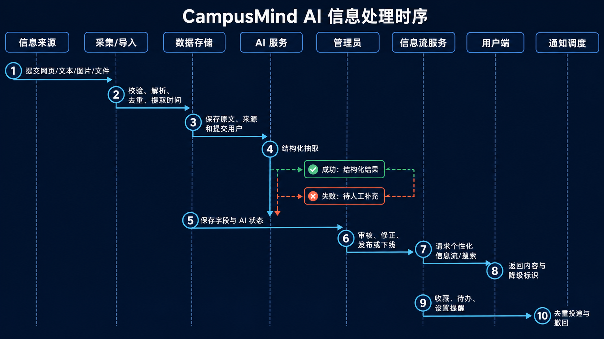
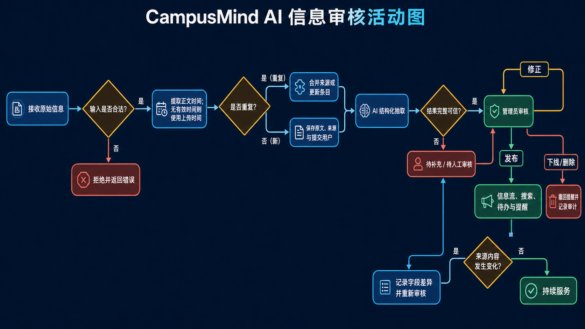
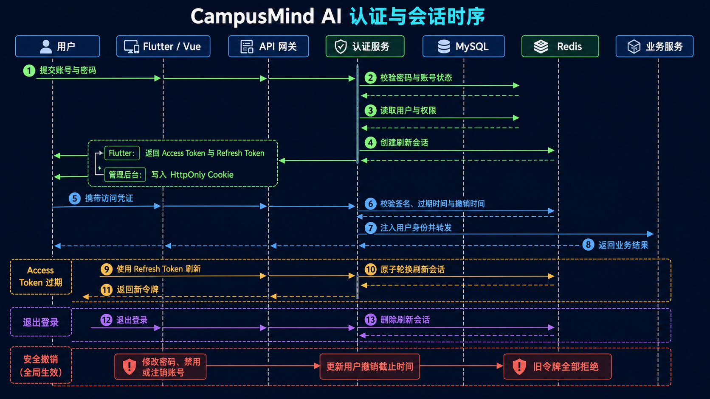
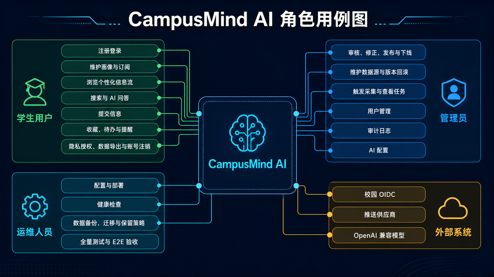
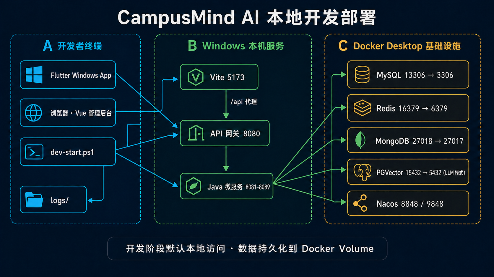

# CampusMind AI 系统图集

本图集基于当前项目的微服务边界、认证链路、信息生命周期和本地开发环境重新设计，所有图片均使用统一的企业级深色技术视觉。

## 1. 系统架构图

展示 Flutter 用户端、Vue 管理后台、API 网关、业务微服务以及 MySQL、Redis、MongoDB、PGVector、Nacos 的整体关系。

## 2. 信息采集、审核与分发时序图

展示公开来源或用户提交的信息从校验、去重、时间提取、AI 结构化、管理员审核，到信息流分发与提醒投递的完整链路。

## 3. 信息审核与变更活动图

展示输入校验、发布时间回填、重复内容处理、AI 可信度判断、人工审核、发布、下线和来源变更复审流程。

## 4. 登录、刷新与会话撤销时序图

展示 Flutter Bearer Token、管理后台 HttpOnly Cookie、刷新令牌原子轮换、主动注销和账号级旧令牌撤销。

## 5. 角色用例图

展示学生用户、管理员、运维人员和外部系统在 CampusMind AI 中的主要职责与交互范围。

## 6. 本地开发部署图

展示 Windows 本机上的 Flutter、Vue、网关与 Java 微服务，以及 Docker Desktop 中的数据库和服务发现组件。

