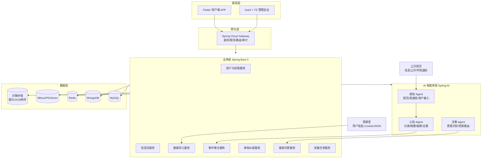
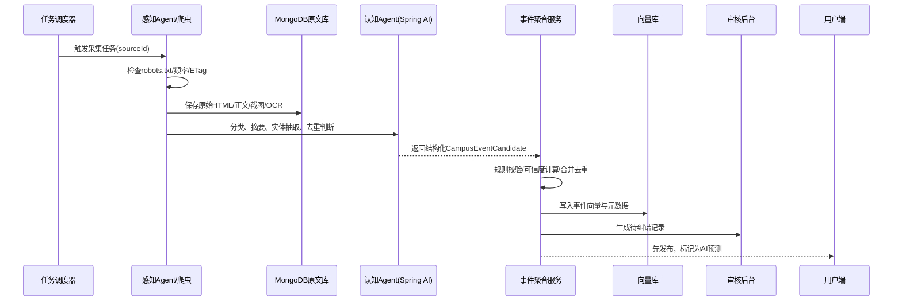
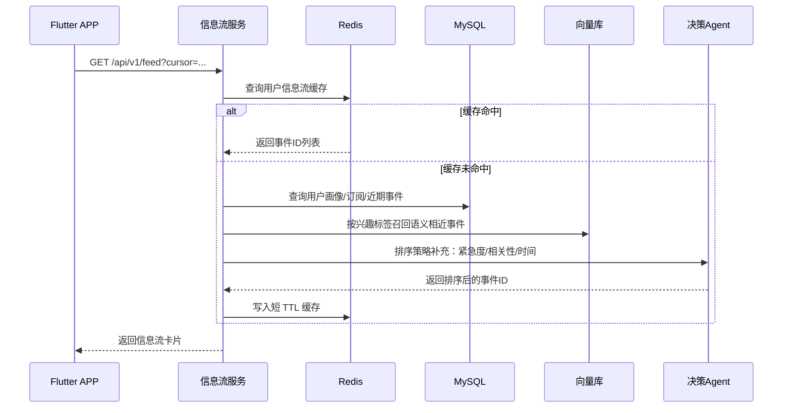
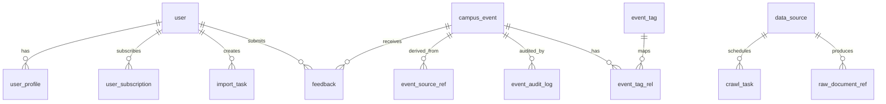
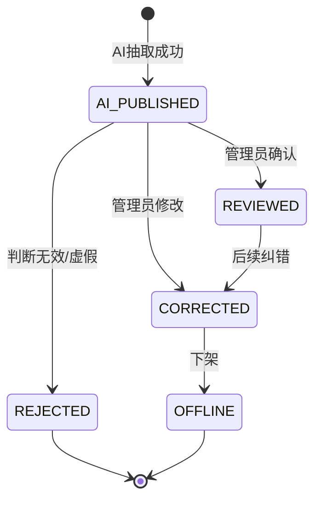
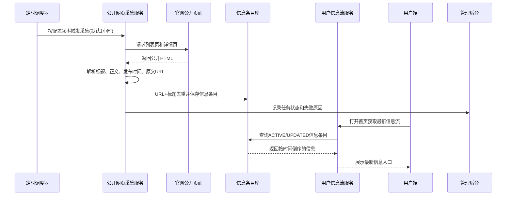
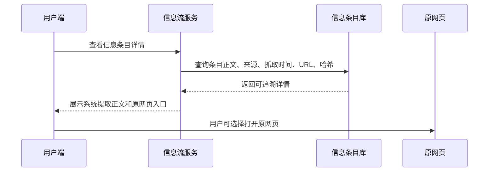

# 基于 AI Agent 的校园事件自动感知与信息聚合系统 Design Document

## 1. 项目概述

### 1.1 项目背景与目标

校园信息通常分散在学校信息公开栏目、学院通知页、教务平台、雨课堂、社群转发文本、截图图片等多个来源中。学生需要反复切换平台查找课程、考试、活动、讲座、竞赛、停课、补课、办事通知等信息，管理员也缺少统一的信息纠错、归档与分发工具。

本项目建设“基于 AI Agent 的校园事件自动感知与信息聚合系统”，通过公开网页合规采集、用户手动导入雨课堂 Cookie/JSON、文本/图片 OCR 输入等方式汇聚校园多源信息，再由 Spring AI 驱动的 Agent 完成分类、摘要、去重、实体抽取、个性化推荐和对话检索。系统采用“先发布并标记为 AI 预测 + 管理员后台纠错”的审核策略，在保证信息及时性的同时保留人工校正闭环。

核心目标：

- 建立统一校园事件中心，聚合公告、课程、作业、考试、活动、讲座、竞赛、服务通知等信息。
- 使用 AI Agent 将非结构化文本转为结构化事件，降低人工整理成本。
- 支持用户个性化信息流、自然语言问答、关键词与语义检索。
- 保证公开网页采集合规，雨课堂数据通过用户主动授权或手动粘贴方式获取。
- 提供管理后台纠错、审核、溯源、统计与运营能力。

### 1.2 核心功能列表

| 模块 | 功能 | 说明 |
|---|---|---|
| 用户端 APP | 信息流 | 按用户学院、专业、年级、课程、兴趣展示校园事件 |
| 用户端 APP | AI 对话 | 用户可询问“本周有什么考试”“明天有哪些讲座”等 |
| 用户端 APP | 文本/图片导入 | 支持粘贴通知文本、上传截图，OCR 后进入 AI 解析流程 |
| 用户端 APP | 雨课堂导入 | 用户手动粘贴 Cookie 或 JSON 数据，系统解析课程/作业/通知 |
| 管理后台 | 事件审核纠错 | 对 AI 预测事件进行修改、合并、下架、标注可信度 |
| 管理后台 | 数据源管理 | 配置公开网页采集源、抓取间隔、robots 状态、解析规则 |
| 管理后台 | 采集监控 | 查看任务状态、失败原因、反爬限流、增量抓取记录 |
| 后端服务 | 事件聚合 | 多源数据入库、去重、聚类、摘要、实体抽取 |
| AI 层 | 三类 Agent | 感知 Agent、认知 Agent、决策 Agent |
| 数据层 | 多库协同 | MySQL 存业务数据，MongoDB 存原文，Redis 缓存，Milvus/PGVector 存向量 |

### 1.3 技术选型说明

| 类型 | 技术 | 选型理由 |
|---|---|---|
| 用户端 | Flutter | 跨 Android/iOS，一套代码支持校园移动端高频使用场景 |
| 管理后台 | Vue 3 + TypeScript | 适合构建审核、配置、列表、图表类后台系统 |
| 网关 | Spring Cloud Gateway | 统一鉴权、限流、路由、灰度、日志追踪 |
| 后端 | Spring Boot 3 + JDK 17 | 生态成熟，适合微服务、AI 集成、数据处理任务 |
| ORM | MyBatis-Plus | 统一关系型数据库访问，基于 Mapper/Wrapper 提供简洁 CRUD 与可控 SQL 扩展 |
| AI | Spring AI | 提供 ChatClient、EmbeddingModel、VectorStore 等统一抽象，降低模型厂商绑定 |
| 关系库 | MySQL | 存用户、事件、订阅、审核、任务等强事务数据 |
| 缓存 | Redis | 信息流缓存、热点事件、限流、分布式锁、任务状态 |
| 文档库 | MongoDB | 存原始网页、OCR 文本、雨课堂原始 JSON、模型中间结果 |
| 向量库 | Milvus 或 PGVector | 存事件文本向量，用于语义检索、去重、RAG 问答 |
| 爬虫 | WebMagic / Playwright | WebMagic 适合静态网页，Playwright 适合公开网页 JS 渲染场景 |
| OCR | PaddleOCR / 云 OCR | 支持截图、海报、公告图片文字提取 |

## 2. 系统架构设计

### 2.1 总体架构图



### 2.2 各层级职责说明

| 层级 | 职责 | 关键设计 |
|---|---|---|
| 表现层 | 用户浏览、搜索、对话、导入；管理员审核、配置、监控 | APP 侧强调信息流和提醒，后台侧强调纠错效率和可追溯 |
| 网关层 | JWT 鉴权、API 路由、限流、访问日志、灰度发布 | 按用户端、后台、AI 接口设置不同限流规则 |
| 业务层 | 用户、事件、信息流、导入、搜索、审核、任务调度 | 保持 AI 结果可回滚，业务状态以 MySQL 为准 |
| AI 层 | 感知、认知、决策三类 Agent | Agent 输出必须结构化，必须保存 prompt 版本和模型版本 |
| 数据层 | 事务、原文、缓存、向量、附件存储 | MySQL 存主数据，MongoDB 存原文和中间结果，向量库存语义索引 |

### 2.4 后端持久层规范

所有 Spring Boot 3 业务服务统一使用 MyBatis-Plus 操作 MySQL，不使用 Spring Data JPA。Mapper 接口放在各服务 `infrastructure.mapper` 包下并继承 `BaseMapper<T>`；实体类通过 `@TableName`、`@TableId`、`@TableField` 与数据库表结构保持显式映射。简单条件查询优先使用 `LambdaQueryWrapper`，复杂查询再补充 XML 或注解 SQL，避免把业务 SQL 拼接散落在 controller/service 中。

示例：

```java
@TableName("user")
public class UserAccount {
    @TableId(type = IdType.AUTO)
    private Long id;
    private String username;
    @TableField("password_hash")
    private String passwordHash;
}

public interface UserAccountMapper extends BaseMapper<UserAccount> {
}
```

### 2.3 核心业务流程时序图

#### 2.3.1 数据采集处理流程



#### 2.3.2 个性化推荐流程



## 3. 数据库设计

### 3.1 MySQL ER 图设计



### 3.2 MySQL 核心表结构

#### 3.2.1 用户与画像

```sql
CREATE TABLE user (
  id BIGINT PRIMARY KEY AUTO_INCREMENT COMMENT '用户ID',
  username VARCHAR(64) NOT NULL COMMENT '登录名',
  phone VARCHAR(32) NULL COMMENT '手机号，需加密或脱敏展示',
  password_hash VARCHAR(255) NOT NULL COMMENT '密码哈希',
  role VARCHAR(32) NOT NULL DEFAULT 'STUDENT' COMMENT 'STUDENT/ADMIN/SUPER_ADMIN',
  status TINYINT NOT NULL DEFAULT 1 COMMENT '1正常 0禁用',
  created_at DATETIME NOT NULL DEFAULT CURRENT_TIMESTAMP,
  updated_at DATETIME NOT NULL DEFAULT CURRENT_TIMESTAMP ON UPDATE CURRENT_TIMESTAMP,
  UNIQUE KEY uk_user_username (username),
  KEY idx_user_role_status (role, status)
) COMMENT='用户表';

CREATE TABLE user_profile (
  id BIGINT PRIMARY KEY AUTO_INCREMENT,
  user_id BIGINT NOT NULL,
  college VARCHAR(128) NULL COMMENT '学院',
  major VARCHAR(128) NULL COMMENT '专业',
  grade VARCHAR(32) NULL COMMENT '年级',
  class_name VARCHAR(128) NULL COMMENT '班级',
  interest_tags JSON NULL COMMENT '兴趣标签，如讲座/竞赛/就业',
  course_codes JSON NULL COMMENT '课程标识列表',
  updated_at DATETIME NOT NULL DEFAULT CURRENT_TIMESTAMP ON UPDATE CURRENT_TIMESTAMP,
  UNIQUE KEY uk_profile_user (user_id),
  KEY idx_profile_college_major_grade (college, major, grade)
) COMMENT='用户画像表';
```

#### 3.2.2 事件、来源与审核

```sql
CREATE TABLE campus_event (
  id BIGINT PRIMARY KEY AUTO_INCREMENT,
  title VARCHAR(255) NOT NULL COMMENT '事件标题',
  summary TEXT NULL COMMENT 'AI摘要或人工摘要',
  event_type VARCHAR(64) NOT NULL COMMENT 'NOTICE/COURSE/EXAM/HOMEWORK/ACTIVITY/LECTURE/COMPETITION/SERVICE',
  source_type VARCHAR(64) NOT NULL COMMENT 'PUBLIC_WEB/RAIN_CLASSROOM/USER_TEXT/USER_IMAGE',
  status VARCHAR(32) NOT NULL DEFAULT 'AI_PUBLISHED' COMMENT 'AI_PUBLISHED/REVIEWED/CORRECTED/REJECTED/OFFLINE',
  confidence DECIMAL(5,4) NOT NULL DEFAULT 0.0000 COMMENT 'AI置信度',
  start_time DATETIME NULL,
  end_time DATETIME NULL,
  location VARCHAR(255) NULL,
  organizer VARCHAR(255) NULL COMMENT '发布单位或课程教师',
  target_scope JSON NULL COMMENT '适用范围：学院/专业/年级/课程',
  tags JSON NULL COMMENT '标签',
  dedup_key CHAR(64) NULL COMMENT '标题+时间+来源生成的SHA256',
  vector_doc_id VARCHAR(128) NULL COMMENT '向量库文档ID',
  published_at DATETIME NULL,
  created_at DATETIME NOT NULL DEFAULT CURRENT_TIMESTAMP,
  updated_at DATETIME NOT NULL DEFAULT CURRENT_TIMESTAMP ON UPDATE CURRENT_TIMESTAMP,
  KEY idx_event_type_time (event_type, start_time),
  KEY idx_event_status_created (status, created_at),
  KEY idx_event_source_type (source_type),
  UNIQUE KEY uk_event_dedup_key (dedup_key)
) COMMENT='校园事件主表';

CREATE TABLE event_source_ref (
  id BIGINT PRIMARY KEY AUTO_INCREMENT,
  event_id BIGINT NOT NULL,
  source_id BIGINT NULL COMMENT '公开网页数据源ID',
  raw_doc_id VARCHAR(64) NOT NULL COMMENT 'MongoDB原始文档ID',
  source_url VARCHAR(1024) NULL,
  source_title VARCHAR(255) NULL,
  content_hash CHAR(64) NOT NULL,
  created_at DATETIME NOT NULL DEFAULT CURRENT_TIMESTAMP,
  KEY idx_ref_event (event_id),
  KEY idx_ref_hash (content_hash)
) COMMENT='事件来源引用表';

CREATE TABLE event_audit_log (
  id BIGINT PRIMARY KEY AUTO_INCREMENT,
  event_id BIGINT NOT NULL,
  operator_id BIGINT NOT NULL,
  action VARCHAR(64) NOT NULL COMMENT 'REVIEW/CORRECT/MERGE/REJECT/OFFLINE',
  before_snapshot JSON NULL,
  after_snapshot JSON NULL,
  comment VARCHAR(512) NULL,
  created_at DATETIME NOT NULL DEFAULT CURRENT_TIMESTAMP,
  KEY idx_audit_event_time (event_id, created_at),
  KEY idx_audit_operator (operator_id)
) COMMENT='事件审核日志表';
```

#### 3.2.3 数据源、采集任务与导入任务

```sql
CREATE TABLE data_source (
  id BIGINT PRIMARY KEY AUTO_INCREMENT,
  name VARCHAR(128) NOT NULL,
  source_type VARCHAR(64) NOT NULL COMMENT 'PUBLIC_WEB',
  base_url VARCHAR(1024) NOT NULL,
  robots_url VARCHAR(1024) NULL,
  crawl_interval_seconds INT NOT NULL DEFAULT 5 COMMENT '必须大于2秒',
  parser_type VARCHAR(64) NOT NULL COMMENT 'WEBMAGIC/PLAYWRIGHT/RSS/SITEMAP',
  selector_config JSON NULL COMMENT 'CSS/XPath/正文抽取规则',
  enabled TINYINT NOT NULL DEFAULT 1,
  last_crawled_at DATETIME NULL,
  created_at DATETIME NOT NULL DEFAULT CURRENT_TIMESTAMP,
  updated_at DATETIME NOT NULL DEFAULT CURRENT_TIMESTAMP ON UPDATE CURRENT_TIMESTAMP,
  KEY idx_source_enabled (enabled),
  UNIQUE KEY uk_source_base_url (base_url(255))
) COMMENT='公开网页数据源表';

CREATE TABLE crawl_task (
  id BIGINT PRIMARY KEY AUTO_INCREMENT,
  source_id BIGINT NOT NULL,
  task_status VARCHAR(32) NOT NULL COMMENT 'PENDING/RUNNING/SUCCESS/FAILED/SKIPPED',
  crawl_url VARCHAR(1024) NOT NULL,
  http_status INT NULL,
  etag VARCHAR(255) NULL,
  last_modified VARCHAR(255) NULL,
  fail_reason VARCHAR(1024) NULL,
  started_at DATETIME NULL,
  finished_at DATETIME NULL,
  KEY idx_task_source_status (source_id, task_status),
  KEY idx_task_started (started_at)
) COMMENT='采集任务表';

CREATE TABLE import_task (
  id BIGINT PRIMARY KEY AUTO_INCREMENT,
  user_id BIGINT NOT NULL,
  import_type VARCHAR(64) NOT NULL COMMENT 'RAIN_COOKIE/RAIN_JSON/USER_TEXT/USER_IMAGE',
  task_status VARCHAR(32) NOT NULL DEFAULT 'PENDING',
  raw_doc_id VARCHAR(64) NULL,
  result_summary JSON NULL,
  error_message VARCHAR(1024) NULL,
  created_at DATETIME NOT NULL DEFAULT CURRENT_TIMESTAMP,
  finished_at DATETIME NULL,
  KEY idx_import_user_time (user_id, created_at),
  KEY idx_import_status (task_status)
) COMMENT='用户导入任务表';
```

### 3.3 MongoDB 文档结构设计

#### 3.3.1 raw_documents 集合

```json
{
  "_id": "ObjectId",
  "sourceType": "PUBLIC_WEB | RAIN_CLASSROOM | USER_TEXT | USER_IMAGE",
  "sourceUrl": "https://example.edu.cn/notice/123",
  "title": "关于举办校园讲座的通知",
  "rawHtml": "<html>...</html>",
  "plainText": "正文文本",
  "contentHash": "sha256",
  "httpMeta": {
    "status": 200,
    "etag": "\"abc\"",
    "lastModified": "Tue, 07 Jul 2026 08:00:00 GMT",
    "fetchedAt": "2026-07-07T10:00:00+08:00"
  },
  "ocrMeta": {
    "imageObjectKey": "oss://bucket/image.png",
    "engine": "PaddleOCR",
    "confidence": 0.94
  },
  "createdAt": "ISODate"
}
```

索引建议：

- `{ sourceType: 1, createdAt: -1 }`
- `{ contentHash: 1 }` 唯一索引，避免同一原文重复入库。
- `{ sourceUrl: 1, "httpMeta.fetchedAt": -1 }`

#### 3.3.2 ai_processing_records 集合

```json
{
  "_id": "ObjectId",
  "rawDocId": "ObjectId",
  "agentType": "COGNITION",
  "promptVersion": "event-extract-v1.0.0",
  "modelProvider": "openai-compatible-provider",
  "modelName": "gpt-4o-mini",
  "inputDigest": "sha256",
  "output": {
    "title": "讲座通知",
    "eventType": "LECTURE",
    "summary": "本周三举办人工智能主题讲座。",
    "confidence": 0.91,
    "entities": {
      "time": "2026-07-08 19:00",
      "location": "图书馆报告厅",
      "organizer": "软件学院"
    }
  },
  "tokens": {
    "prompt": 1200,
    "completion": 350
  },
  "createdAt": "ISODate"
}
```

### 3.4 Redis 缓存策略设计

| Key | 类型 | TTL | 用途 |
|---|---:|---:|---|
| `feed:user:{userId}:v1` | ZSet/List | 5-15 分钟 | 用户信息流事件 ID 列表 |
| `event:detail:{eventId}` | String JSON | 10-30 分钟 | 事件详情缓存 |
| `hot:event:{scope}` | ZSet | 30 分钟 | 校园/学院热点事件 |
| `rate:api:{userId}:{path}` | String Counter | 60 秒 | 用户接口限流 |
| `crawl:lock:{sourceId}` | String | 采集周期 + 30 秒 | 防止同一数据源并发采集 |
| `crawler:robots:{host}` | String JSON | 12 小时 | robots.txt 解析结果缓存 |
| `ai:dedup:{contentHash}` | String | 7 天 | AI 处理去重，避免重复调用模型 |
| `rain:session:{taskId}` | String | 10 分钟 | 雨课堂 Cookie 解析临时态，默认不落库 |

缓存原则：

- 信息流缓存只存事件 ID 和排序分数，事件详情单独缓存，便于局部失效。
- 审核纠错后主动删除 `event:detail:{eventId}`，并按影响范围删除相关 feed key。
- 采集任务必须使用 Redis 分布式锁，防止定时任务重入。
- 雨课堂 Cookie 默认只放 Redis 短 TTL，不写 MySQL/MongoDB；原始 JSON 可脱敏后保存。

### 3.5 向量数据库集合设计

集合名：`campus_event_vectors`

| 字段 | 类型 | 说明 |
|---|---|---|
| `id` | VARCHAR/INT64 | 向量文档 ID，与 MySQL `vector_doc_id` 对应 |
| `event_id` | BIGINT | MySQL 事件 ID |
| `embedding` | FLOAT_VECTOR | 文本向量，维度与 EmbeddingModel 保持一致 |
| `title` | VARCHAR | 标题 |
| `summary` | VARCHAR | 摘要 |
| `event_type` | VARCHAR | 事件类型 |
| `source_type` | VARCHAR | 数据来源 |
| `college` | VARCHAR | 适用学院 |
| `start_time` | TIMESTAMP | 事件开始时间 |
| `status` | VARCHAR | AI_PUBLISHED/REVIEWED 等 |
| `created_at` | TIMESTAMP | 入库时间 |

向量文本拼接格式：

```text
标题：{title}
类型：{eventType}
时间：{startTime} - {endTime}
地点：{location}
适用范围：{targetScope}
摘要：{summary}
正文片段：{plainTextChunk}
```

## 4. AI 智能体层详细设计

### 4.1 Agent 分层模型

| Agent | 输入 | 输出 | 主要职责 |
|---|---|---|---|
| 感知 Agent | URL、HTML、用户粘贴 JSON/Cookie、图片、文本 | 规范化 RawDocument | 采集、解析、OCR、正文抽取、增量判断 |
| 认知 Agent | RawDocument、历史相似事件 | CampusEventCandidate | 分类、摘要、时间地点抽取、去重、置信度 |
| 决策 Agent | 用户问题、用户画像、上下文 | SearchPlan/Answer | 意图识别、检索路由、回答生成、推荐策略 |

### 4.2 感知 Agent：爬虫策略设计

#### 4.2.1 公开网页合规采集

具体策略：

1. 数据源只配置公开页面，如学校信息公开专栏、学院通知公告页面；禁止采集登录后页面、个人隐私页、验证码保护页。
2. 每个 host 首次采集前读取并解析 `robots.txt`，缓存 12 小时；若 `Disallow` 命中目标路径，则任务标记为 `SKIPPED_ROBOTS`。
3. 同一域名请求间隔配置为 5 秒，系统强制要求 `crawl_interval_seconds > 2`；出现 429/403/503 时指数退避，暂停该数据源。
4. 使用 `If-None-Match`、`If-Modified-Since` 做增量抓取；304 不进入 AI 流程。
5. 对列表页只提取详情页链接；详情页根据 `contentHash` 去重。
6. 优先 WebMagic 静态抓取；仅公开网页需要 JS 渲染时使用 Playwright，且不绕过验证码、不模拟登录、不规避访问控制。
7. User-Agent 明确标识系统用途和联系方式，例如 `CampusEventBot/1.0 (+contact: admin@example.edu)`。

示例配置：

```yaml
campus:
  crawler:
    default-interval-seconds: 5
    min-interval-seconds: 3
    robots-cache-ttl-hours: 12
    max-retry: 3
    user-agent: "CampusEventBot/1.0 (+contact: admin@example.edu)"
    backoff:
      initial-seconds: 30
      multiplier: 2.0
      max-seconds: 3600
```

采集伪代码：

```java
public RawDocument crawl(CrawlRequest request) {
    RobotsPolicy policy = robotsService.getPolicy(request.url());
    if (!policy.isAllowed(request.url())) {
        throw new CrawlSkippedException("Blocked by robots.txt");
    }

    rateLimiter.acquire(request.host(), Duration.ofSeconds(request.intervalSeconds()));

    HttpHeaders headers = conditionalHeadersRepository.load(request.url());
    FetchResult result = webFetcher.fetch(request.url(), headers);

    if (result.statusCode() == 304) {
        throw new CrawlSkippedException("Not modified");
    }
    if (List.of(403, 429, 503).contains(result.statusCode())) {
        backoffService.pauseSource(request.sourceId(), result.statusCode());
        throw new CrawlRetryLaterException("Remote server throttled");
    }

    String text = articleExtractor.extract(result.html(), request.selectorConfig());
    String hash = DigestUtils.sha256Hex(text);
    return rawDocumentRepository.savePublicWeb(request, result, text, hash);
}
```

#### 4.2.2 反爬处理方案

本系统的“应对反爬”不以绕过限制为目标，而是以降低打扰、提高稳定性为目标：

- 频率控制：host 级别限速 + 数据源级别分布式锁 + 失败后退避。
- 增量请求：使用 ETag、Last-Modified、内容 hash，减少重复请求。
- 页面解析容错：列表页结构变化时只标记解析失败，不扩大抓取范围。
- JS 渲染：Playwright 只等待公开内容正常渲染，设置固定 viewport 和超时。
- 封禁处理：连续 403/429 时自动熔断数据源，通知管理员调整频率或申请授权。
- 人工配置：后台支持 CSS/XPath 规则更新，不通过高并发探测页面结构。

#### 4.2.3 雨课堂数据解析逻辑

雨课堂没有公开 API，因此采用“用户手动粘贴 Cookie 或 JSON 数据”的方案。系统不要求用户提供账号密码，不进行自动登录。

推荐两种导入模式：

| 模式 | 适用场景 | 安全策略 |
|---|---|---|
| JSON 粘贴模式 | 用户从浏览器开发者工具或页面复制课程/作业/通知响应 JSON | 最推荐；后端只解析用户提交文本，不代用户请求雨课堂 |
| Cookie 临时解析模式 | 用户粘贴当前登录态 Cookie，后端一次性拉取用户授权范围内的课程/作业数据 | Cookie 仅 Redis 临时保存 10 分钟；不写库；请求域名白名单；任务结束立即删除 |

JSON 解析流程：

1. 用户在 APP/网页导入页选择“雨课堂 JSON 导入”。
2. 用户粘贴课程列表、作业列表、课堂通知等 JSON。
3. 后端校验 JSON 大小、字段白名单、敏感字段脱敏。
4. `RainClassroomParser` 将 JSON 映射为统一 `RawDocument`。
5. 认知 Agent 抽取作业截止时间、课程名称、教师、任务说明。

Cookie 临时解析流程：

1. 用户明确勾选授权说明：仅用于本次导入，不保存 Cookie。
2. 后端校验 Cookie 格式和来源域名白名单，只允许访问预配置雨课堂相关域名。
3. 后端以低频串行请求拉取课程、作业、通知 JSON；失败即终止，不重试撞库。
4. 原始响应脱敏后入 MongoDB，Cookie 从 Redis 删除。
5. 生成 `import_task` 结果，用户可查看导入条数和失败原因。

解析代码示例：

```java
@Service
public class RainClassroomParser {

    private final ObjectMapper objectMapper;

    public List<RawRainItem> parseJson(String rawJson) throws JsonProcessingException {
        JsonNode root = objectMapper.readTree(rawJson);
        List<RawRainItem> items = new ArrayList<>();

        JsonNode data = root.path("data");
        JsonNode list = data.isArray() ? data : data.path("list");
        if (!list.isArray()) {
            throw new IllegalArgumentException("未识别的雨课堂JSON结构");
        }

        for (JsonNode node : list) {
            items.add(new RawRainItem(
                    node.path("courseName").asText(null),
                    node.path("title").asText(null),
                    node.path("content").asText(null),
                    node.path("deadline").asText(null),
                    node.path("teacherName").asText(null)
            ));
        }
        return items;
    }
}
```

### 4.3 认知 Agent：Spring AI Prompt 设计

结构化输出对象：

```java
public record CampusEventCandidate(
        String title,
        String eventType,
        String summary,
        String startTime,
        String endTime,
        String location,
        String organizer,
        List<String> targetScopes,
        List<String> tags,
        double confidence,
        boolean needHumanReview,
        String reason
) {}
```

分类、摘要、抽取 Prompt：

```text
你是校园信息聚合系统的认知Agent。请从输入文本中抽取校园事件。
要求：
1. 事件类型只能是 NOTICE、COURSE、EXAM、HOMEWORK、ACTIVITY、LECTURE、COMPETITION、SERVICE、OTHER。
2. 摘要不超过80字，必须保留时间、地点、对象、动作。
3. 如果时间、地点、对象缺失，不要编造，字段返回null或空数组。
4. 判断该事件是否需要人工审核：时间冲突、来源不明、OCR置信度低、内容含糊时返回true。
5. 输出必须符合CampusEventCandidate结构。

输入来源：{sourceType}
输入文本：
{plainText}
```

Spring AI 调用示例：

```java
@Service
public class EventCognitionAgent {

    private final ChatClient chatClient;

    public EventCognitionAgent(ChatClient.Builder builder) {
        this.chatClient = builder
                .defaultSystem("你是严谨的校园事件信息抽取助手，不得编造不存在的信息。")
                .build();
    }

    public CampusEventCandidate extract(String sourceType, String plainText) {
        return chatClient.prompt()
                .user(u -> u.text("""
                        请从校园文本中抽取事件，字段缺失时返回null。
                        来源：{sourceType}
                        文本：{plainText}
                        """)
                        .param("sourceType", sourceType)
                        .param("plainText", plainText))
                .call()
                .entity(CampusEventCandidate.class);
    }
}
```

去重 Prompt：

```text
你是校园事件去重Agent。请判断候选事件A是否与历史事件B表达同一事项。
判断依据优先级：
1. 标题核心语义是否相同；
2. 时间、地点、组织者是否一致或高度重合；
3. 适用对象是否一致；
4. 来源是否为同一通知的转载或截图。
输出：SAME、RELATED、DIFFERENT，并给出0到1的相似度和理由。
```

去重策略：

- 第一层：`dedup_key = sha256(normalizedTitle + normalizedTime + sourceType)` 精确去重。
- 第二层：MySQL 按标题、时间窗口、来源召回候选。
- 第三层：向量库按候选事件文本 topK 召回相似事件。
- 第四层：认知 Agent 判断 SAME/RELATED/DIFFERENT；SAME 合并来源，RELATED 建立关联。

### 4.4 决策 Agent：意图识别与搜索路由

意图类型：

| 意图 | 示例 | 路由 |
|---|---|---|
| FEED_QUERY | “今天有什么通知” | MySQL 条件查询 + Redis 热点 |
| SEMANTIC_SEARCH | “最近有没有 AI 相关讲座” | 向量库召回 + MySQL 过滤 |
| PERSONAL_SCHEDULE | “我本周有哪些作业” | 用户画像 + 雨课堂事件 |
| QA_EXPLAIN | “这个通知是什么意思” | RAG 问答 |
| IMPORT_HELP | “怎么导入雨课堂” | 帮助知识库 |

搜索计划对象：

```java
public record SearchPlan(
        String intent,
        List<String> eventTypes,
        String timeRange,
        List<String> scopes,
        boolean useVectorSearch,
        boolean usePersonalProfile,
        int topK
) {}
```

路由示例：

```java
public SearchResult route(UserContext user, String query) {
    SearchPlan plan = decisionAgent.plan(query, user);

    if (plan.useVectorSearch()) {
        return semanticSearchService.search(query, plan, user);
    }
    if ("PERSONAL_SCHEDULE".equals(plan.intent())) {
        return scheduleService.queryPersonalEvents(user, plan);
    }
    return eventQueryService.queryByCondition(plan, user);
}
```

### 4.5 向量化与检索流程设计

写入流程：

1. 事件发布或纠错后，拼接标题、摘要、时间、地点、范围、正文片段。
2. 调用 Spring AI `EmbeddingModel` 生成向量。
3. 使用 `VectorStore.add()` 写入向量和元数据。
4. MySQL 记录 `vector_doc_id`。
5. 事件被下架或合并时，同步删除或更新向量。

Spring AI VectorStore 示例：

```java
@Service
public class EventVectorService {

    private final VectorStore vectorStore;

    public EventVectorService(VectorStore vectorStore) {
        this.vectorStore = vectorStore;
    }

    public void indexEvent(CampusEvent event) {
        Document document = new Document(
                buildVectorText(event),
                Map.of(
                        "eventId", event.getId().toString(),
                        "eventType", event.getEventType(),
                        "status", event.getStatus(),
                        "startTime", String.valueOf(event.getStartTime())
                )
        );
        vectorStore.add(List.of(document));
    }

    public List<Document> search(String query, int topK) {
        return vectorStore.similaritySearch(
                SearchRequest.builder()
                        .query(query)
                        .topK(topK)
                        .build()
        );
    }
}
```

## 5. 接口设计 API

### 5.1 RESTful API 接口列表

| 模块 | 方法 | 路径 | 说明 |
|---|---|---|---|
| 认证 | POST | `/api/v1/auth/login` | 登录 |
| 用户 | GET | `/api/v1/users/me` | 获取当前用户 |
| 用户 | PUT | `/api/v1/users/me/profile` | 更新画像 |
| 信息流 | GET | `/api/v1/feed` | 获取个性化信息流 |
| 事件 | GET | `/api/v1/events/{id}` | 事件详情 |
| 事件 | GET | `/api/v1/events/search` | 条件搜索 |
| 导入 | POST | `/api/v1/import/text` | 粘贴文本导入 |
| 导入 | POST | `/api/v1/import/image` | 图片 OCR 导入 |
| 导入 | POST | `/api/v1/import/rain/json` | 雨课堂 JSON 导入 |
| 导入 | POST | `/api/v1/import/rain/cookie` | 雨课堂 Cookie 临时导入 |
| AI | POST | `/api/v1/ai/chat` | AI 对话问答 |
| 反馈 | POST | `/api/v1/events/{id}/feedback` | 用户反馈纠错 |
| 后台 | GET | `/api/admin/events/pending` | 待审核事件列表 |
| 后台 | PUT | `/api/admin/events/{id}/review` | 审核/纠错 |
| 后台 | POST | `/api/admin/sources` | 新增数据源 |
| 后台 | PUT | `/api/admin/sources/{id}` | 修改数据源 |
| 后台 | POST | `/api/admin/crawl-tasks/{sourceId}/run` | 手动触发采集 |
| 后台 | GET | `/api/admin/crawl-tasks` | 采集任务列表 |

### 5.2 核心接口详细定义

#### 5.2.1 获取信息流

```http
GET /api/v1/feed?cursor=2026-07-07T10:00:00&size=20&type=LECTURE
Authorization: Bearer {token}
```

返回：

```json
{
  "items": [
    {
      "id": 1001,
      "title": "人工智能主题讲座通知",
      "summary": "软件学院将于7月8日举办AI主题讲座。",
      "eventType": "LECTURE",
      "status": "AI_PUBLISHED",
      "aiPredicted": true,
      "confidence": 0.91,
      "startTime": "2026-07-08T19:00:00+08:00",
      "location": "图书馆报告厅",
      "tags": ["AI", "讲座"]
    }
  ],
  "nextCursor": "2026-07-07T09:30:00",
  "hasMore": true
}
```

#### 5.2.2 雨课堂 JSON 导入

```http
POST /api/v1/import/rain/json
Content-Type: application/json
Authorization: Bearer {token}
```

请求：

```json
{
  "dataType": "HOMEWORK",
  "rawJson": "{...用户手动粘贴的JSON...}"
}
```

返回：

```json
{
  "taskId": 501,
  "status": "PENDING",
  "message": "已提交解析，完成后将在信息流中展示AI预测事件"
}
```

#### 5.2.3 雨课堂 Cookie 临时导入

```http
POST /api/v1/import/rain/cookie
Content-Type: application/json
Authorization: Bearer {token}
```

请求：

```json
{
  "cookie": "用户手动粘贴的Cookie",
  "importScopes": ["COURSE", "HOMEWORK", "NOTICE"],
  "agreeOneTimeUse": true
}
```

约束：

- `agreeOneTimeUse` 必须为 true。
- Cookie 不落库，只写 Redis，TTL 10 分钟。
- 请求目标只能是后端白名单域名。
- 导入任务结束后立即删除 Cookie。

#### 5.2.4 AI 对话接口

```http
POST /api/v1/ai/chat
Content-Type: application/json
Authorization: Bearer {token}
```

请求：

```json
{
  "sessionId": "chat-20260707-001",
  "message": "我这周有哪些作业和讲座？",
  "usePersonalProfile": true
}
```

返回：

```json
{
  "answer": "你本周有2项作业和1场讲座需要关注...",
  "citations": [
    {
      "eventId": 1001,
      "title": "人工智能主题讲座通知",
      "sourceType": "PUBLIC_WEB"
    }
  ],
  "intent": "PERSONAL_SCHEDULE"
}
```

## 6. 安全与合规方案

### 6.1 爬虫合规性设计

- Robots.txt：采集前检查并缓存，禁止路径直接跳过。
- 频率控制：全局、host、source 三层限流；每个公开网页数据源间隔强制大于 2 秒，建议 5 秒以上。
- 来源范围：只采集公开网页，不采集登录后页面，不破解验证码，不绕过访问控制。
- 增量抓取：使用 ETag、Last-Modified、内容 hash，减少请求量。
- 熔断机制：连续失败或出现 403/429，暂停数据源并通知管理员。
- 可追溯：保存 source_url、抓取时间、HTTP 状态、robots 判断结果、解析规则版本。

### 6.2 用户数据安全

- HTTPS：用户端、后台、网关全链路 HTTPS。
- 鉴权：JWT + Refresh Token；后台管理接口增加 RBAC 权限。
- 密码：BCrypt/Argon2 哈希存储。
- 敏感字段：手机号、雨课堂导入原文中的个人标识脱敏或加密。
- Cookie：雨课堂 Cookie 默认只存 Redis，TTL 10 分钟；任务结束主动删除。
- 审计：管理员纠错、导出、下架操作全部写入审计日志。
- 最小化：只保存生成事件所需字段，不长期保存无必要的个人原始数据。

### 6.3 内容审核机制：先发后审

状态流转：



前端展示规则：

- `AI_PUBLISHED` 事件必须展示“AI 预测”标识和置信度提示。
- 低置信度、OCR 低质量、来源为用户输入的事件默认降低推荐权重。
- 用户可提交“时间错误、地点错误、重复、虚假、不相关”等反馈。
- 管理员纠错后更新 MySQL、MongoDB 处理记录和向量索引。

## 7. 实施与开发建议

### 7.1 开发阶段划分

| 阶段 | 周期 | 目标 | 交付物 |
|---|---:|---|---|
| P0 基础架构 | 1-2 周 | 搭建 Spring Boot、Gateway、MySQL、Redis、MongoDB、基础鉴权 | 可运行后端骨架、用户登录 |
| P1 事件中心 | 2-3 周 | 事件表、信息流、后台审核、用户反馈 | APP 信息流、后台审核页 |
| P2 数据导入 | 2 周 | 文本导入、图片 OCR、雨课堂 JSON/Cookie 导入 | 导入任务闭环 |
| P3 公开网页采集 | 2-3 周 | 数据源配置、robots、限速、WebMagic/Playwright | 合规采集与监控 |
| P4 AI Agent | 3 周 | Spring AI 分类、摘要、去重、意图识别、向量检索 | 三类 Agent 和 RAG 问答 |
| P5 推荐与优化 | 2 周 | 个性化排序、缓存、监控、成本控制 | 稳定可演示版本 |

### 7.2 关键技术难点与解决方案

| 难点 | 风险 | 解决方案 |
|---|---|---|
| 公开网页反爬与结构变化 | 抓取失败、误采集 | robots 检查、限速、退避、后台可配置解析规则、失败告警 |
| 雨课堂无公开 API | 合规和稳定性风险 | 以 JSON 粘贴为主，Cookie 仅一次性临时解析，不保存账号密码 |
| 大模型幻觉 | 编造时间地点 | Prompt 明确缺失返回 null；结构化输出；低置信度进入人工审核 |
| 事件去重困难 | 信息流重复 | hash 精确去重 + 向量召回 + AI 判断 + 管理员合并 |
| OCR 错字 | 时间地点识别错误 | OCR 置信度参与审核策略；关键时间字段用规则二次校验 |
| 多库一致性 | 事件、原文、向量不同步 | 以 MySQL 事件状态为准；使用 outbox 事件异步同步向量库 |
| AI 成本 | 高频调用模型成本高 | contentHash 缓存、批量处理、优先规则抽取、只对候选内容调用模型 |
| 推荐准确性 | 用户感觉不相关 | 用户画像 + 订阅标签 + 点击反馈 + 时间衰减混合排序 |

### 7.3 推荐工程结构

```text
campus-ai-agent-system
├── campus-gateway
├── campus-auth-service
├── campus-event-service
├── campus-import-service
├── campus-crawler-service
├── campus-ai-service
│   ├── agent
│   │   ├── PerceptionAgent.java
│   │   ├── CognitionAgent.java
│   │   └── DecisionAgent.java
│   ├── prompt
│   └── vector
├── campus-admin-web
└── campus-flutter-app
```

### 7.4 后端依赖示例

```xml
<dependencies>
    <dependency>
        <groupId>org.springframework.boot</groupId>
        <artifactId>spring-boot-starter-web</artifactId>
    </dependency>
    <dependency>
        <groupId>com.baomidou</groupId>
        <artifactId>mybatis-plus-spring-boot3-starter</artifactId>
        <version>3.5.14</version>
    </dependency>
    <dependency>
        <groupId>org.springframework.cloud</groupId>
        <artifactId>spring-cloud-starter-gateway</artifactId>
    </dependency>
    <dependency>
        <groupId>org.springframework.ai</groupId>
        <artifactId>spring-ai-starter-model-openai</artifactId>
    </dependency>
    <dependency>
        <groupId>org.springframework.ai</groupId>
        <artifactId>spring-ai-starter-vector-store-pgvector</artifactId>
    </dependency>
    <dependency>
        <groupId>org.springframework.boot</groupId>
        <artifactId>spring-boot-starter-data-redis</artifactId>
    </dependency>
    <dependency>
        <groupId>org.springframework.boot</groupId>
        <artifactId>spring-boot-starter-data-mongodb</artifactId>
    </dependency>
</dependencies>
```

### 7.5 结论

本系统应以“合规采集、可追溯原文、AI 结构化处理、人工纠错闭环”为核心设计原则。技术上以 Spring Boot 3 承载业务服务，以 Spring AI 统一模型调用、结构化输出、向量检索和 RAG 问答，以 MySQL、MongoDB、Redis、Milvus/PGVector 形成多模型数据底座。对于雨课堂等无公开 API 的来源，必须坚持用户主动粘贴 JSON 或一次性 Cookie 授权方案，避免自动登录和长期保存敏感凭证。最终系统既要做到信息聚合及时，也要通过审核、溯源和反馈机制保证校园信息的可信度。

# 附录 A. 信息集中站重构方案

本附录用于补充当前设计文档的阶段性重构方向。原设计中的 AI Agent、语义检索、个性化推荐、审核纠错等能力仍作为后续演进参考；当前第一版优先建设“信息集中站”，目标是让用户不用分散访问多个网站，就能在一个入口及时看到多个公开信息来源的最新完整信息。

## A.1 重构原因与当前偏差

当前工程已经具备爬虫、事件、信息流、AI 抽取和后台审核等模块雏形，但与第一版产品目标存在以下偏差：

| 偏差点 | 当前倾向 | 重构后第一版要求 |
|---|---|---|
| AI 介入时机 | 采集后较早转换为 AI 预测事件 | 先完整采集、完整入库、完整展示，AI 延后接入 |
| 主数据模型 | 以 `campus_event` 事件为中心 | 以“信息条目”为中心，事件化能力后置 |
| 用户展示 | 信息流展示摘要和事件字段 | 用户端按时间倒序展示最新完整信息入口 |
| 原文追溯 | 后台已有部分采集详情，用户端不足 | 每条信息必须保留正文、来源、抓取时间、原网页链接和内容哈希 |
| 后台定位 | 审核纠错后台占比较高 | 第一版改为数据源与采集监控后台 |
| 数据源范围 | 设计包含网页、雨课堂、用户图片、AI 等多入口 | 第一版仅接入公开网页，限定新疆大学官网与新疆大学软件学院官网 |

## A.2 第一版目标

第一版不追求智能总结和复杂推荐，核心目标如下：

1. 统一采集新疆大学官网与新疆大学软件学院官网的公开信息。
2. 按可配置固定频率轮询数据源，默认每 1 小时采集一次。
3. 将采集到的信息保存为可追溯的信息条目，包含标题、发布时间或抓取时间、正文、来源、原网页链接、内容哈希。
4. 用户打开系统后，在用户端按时间倒序看到最新信息流。
5. 默认接收全部信息，订阅能力保留但默认全选。
6. 管理后台用于查看数据源状态、采集任务、失败原因和最近入库条目。
7. 第一版不接入 AI 精简、不做外部通知、不做登录后来源、不做搜索、不处理附件。

第一版成功标准：系统能及时获取多个公开来源的信息，并在一个入口按时间展示，用户不需要再去多个网站分别查找。

## A.3 第一版范围

### A.3.1 明确纳入

| 能力 | 说明 |
|---|---|
| 公开网页采集 | 第一批仅支持新疆大学官网与新疆大学软件学院官网公开页面 |
| 固定频率轮询 | 默认每 1 小时执行一次，可通过配置调整 |
| 信息条目入库 | 保存标题、正文、来源、URL、时间、内容哈希、采集元数据 |
| 时间倒序信息流 | 用户端首页按发布时间或抓取时间倒序展示 |
| 原文查看 | 展示系统提取正文、来源信息、抓取时间、原网页链接 |
| 用户阅读状态 | 每个用户独立维护 NEW / READ / ARCHIVED |
| 后台采集监控 | 查看数据源、采集任务、失败原因、最近入库信息 |

### A.3.2 明确暂不纳入

| 暂不纳入项 | 原因 |
|---|---|
| AI Agent 精简提取 | 等网页、文件、文本三类信息获取稳定后再接入 |
| 手机系统通知、短信、邮件、微信推送 | 第一版“推送”指用户打开系统即可看到最新信息流 |
| 登录后来源、Cookie 来源、雨课堂来源 | 第一版只处理公开可访问网页 |
| 搜索 | 第一版先验证集中展示和原文追溯闭环 |
| 附件解析或下载 | 第一版暂不处理附件 |
| 用户上传文件正文解析 | 第一版仅做后续设计预留，不承诺实现 |
| 全量审核流程 | 公开官网来源直接展示，不把审核作为主流程 |

## A.4 核心业务流程

### A.4.1 公开网页采集到用户信息流



### A.4.2 原文查看流程



若详情页正文解析失败，第一版不将该信息展示给用户，仅在后台展示失败记录、失败原因和原网页链接，等待后续修复解析规则或重试成功后再展示。

## A.5 数据模型调整建议

第一版建议新增或重命名面向“信息条目”的数据模型，避免过早把公开网页通知转换为事件。

### A.5.1 `information_item` 信息条目表

```sql
CREATE TABLE information_item (
  id BIGINT PRIMARY KEY AUTO_INCREMENT,
  source_id BIGINT NOT NULL COMMENT '数据源ID',
  source_name VARCHAR(128) NOT NULL COMMENT '数据源名称',
  source_url VARCHAR(1024) NOT NULL COMMENT '列表页或栏目URL',
  item_url VARCHAR(1024) NOT NULL COMMENT '原网页详情URL',
  title VARCHAR(512) NOT NULL COMMENT '信息标题',
  publish_time DATETIME NULL COMMENT '页面发布时间，无法解析时为空',
  fetched_at DATETIME NOT NULL COMMENT '抓取时间',
  detail_content MEDIUMTEXT NOT NULL COMMENT '系统提取正文',
  content_hash CHAR(64) NOT NULL COMMENT '正文内容哈希',
  item_status VARCHAR(32) NOT NULL DEFAULT 'ACTIVE' COMMENT 'ACTIVE/UPDATED/OFFLINE/FAILED',
  parse_status VARCHAR(32) NOT NULL COMMENT 'DETAIL_SUCCESS/PARSE_FAILED/DETAIL_FAILED',
  parse_error VARCHAR(1024) NULL COMMENT '解析失败原因',
  created_at DATETIME NOT NULL DEFAULT CURRENT_TIMESTAMP,
  updated_at DATETIME NOT NULL DEFAULT CURRENT_TIMESTAMP ON UPDATE CURRENT_TIMESTAMP,
  UNIQUE KEY uk_information_item_url_title (item_url(512), title(191)),
  KEY idx_information_item_time (publish_time, fetched_at),
  KEY idx_information_item_source (source_id, fetched_at),
  KEY idx_information_item_status (item_status)
) COMMENT='信息集中站信息条目表';
```

去重规则：第一版使用 URL + 标题去重。同一 URL 与标题相同视为同一条信息；若正文内容哈希变化，则更新条目为 `UPDATED`，记录更新时间。第一版不做标题相似合并。

全局状态建议：

| 状态 | 含义 |
|---|---|
| ACTIVE | 当前可展示的信息 |
| UPDATED | 已发生内容更新的信息 |
| OFFLINE | 来源页面不可访问或信息被下线 |
| FAILED | 采集或解析失败，仅后台可见 |

### A.5.2 `user_information_state` 用户阅读状态表

```sql
CREATE TABLE user_information_state (
  id BIGINT PRIMARY KEY AUTO_INCREMENT,
  user_id BIGINT NOT NULL,
  item_id BIGINT NOT NULL,
  read_status VARCHAR(32) NOT NULL DEFAULT 'NEW' COMMENT 'NEW/READ/ARCHIVED',
  first_seen_at DATETIME NOT NULL DEFAULT CURRENT_TIMESTAMP,
  read_at DATETIME NULL,
  archived_at DATETIME NULL,
  UNIQUE KEY uk_user_item_state (user_id, item_id),
  KEY idx_user_read_status (user_id, read_status, first_seen_at)
) COMMENT='用户信息条目阅读状态表';
```

`NEW / READ / ARCHIVED` 是用户级状态，不是信息条目的全局状态。默认用户接收全部信息，后续订阅能力可在该表或用户偏好表基础上扩展。

### A.5.3 用户个人导入预留

用户上传文件或粘贴文本第一版定位为“个人信息收藏”，仅自己可见，并标记为“个人导入”。文件解析能力暂不承诺实现，仅在接口和模型上预留：

| 字段 | 说明 |
|---|---|
| `owner_user_id` | 个人导入归属用户 |
| `import_type` | PDF/WORD/EXCEL/IMAGE/TEXT/LINK |
| `original_file_id` | 原文件对象存储或文档库ID |
| `plain_text` | 后续解析出的正文，可为空 |
| `visibility` | PERSONAL/PUBLIC，第一版固定 PERSONAL |

## A.6 接口调整建议

### A.6.1 用户端信息流

```http
GET /api/v1/information/feed?cursor=2026-07-09T10:00:00&size=20
```

响应示例：

```json
{
  "items": [
    {
      "id": 1001,
      "title": "关于开展创新创业竞赛报名的通知",
      "sourceName": "软件学院创新创业通知公告",
      "publishTime": "2026-07-09T09:30:00",
      "fetchedAt": "2026-07-09T10:00:03",
      "readStatus": "NEW",
      "itemStatus": "ACTIVE",
      "preview": "为进一步提升学生创新创业能力，现组织开展...",
      "originalUrl": "https://ss.xju.edu.cn/info/..."
    }
  ],
  "nextCursor": "2026-07-09T09:30:00",
  "hasMore": true
}
```

### A.6.2 信息条目详情

```http
GET /api/v1/information/items/{id}
```

详情页必须返回：

| 字段 | 说明 |
|---|---|
| `title` | 标题 |
| `detailContent` | 系统提取正文 |
| `sourceName` | 来源名称 |
| `sourceUrl` | 来源栏目地址 |
| `originalUrl` | 原网页详情地址 |
| `publishTime` | 页面发布时间 |
| `fetchedAt` | 抓取时间 |
| `contentHash` | 内容哈希 |
| `itemStatus` | 信息条目全局状态 |
| `readStatus` | 当前用户阅读状态 |

### A.6.3 用户阅读状态

```http
PUT /api/v1/information/items/{id}/read-status
```

请求示例：

```json
{
  "readStatus": "READ"
}
```

允许值：`NEW`、`READ`、`ARCHIVED`。

### A.6.4 管理后台采集监控

后台不以审核为主流程，第一版重点提供：

| 接口 | 说明 |
|---|---|
| `GET /api/admin/sources` | 数据源列表、启用状态、最近采集时间 |
| `POST /api/admin/sources/{id}/crawl` | 手动触发单个来源采集 |
| `GET /api/admin/crawl-tasks` | 采集任务列表、状态、失败原因 |
| `GET /api/admin/information/items` | 最近入库信息条目 |
| `GET /api/admin/information/items/failed` | 解析失败或抓取失败条目 |

## A.7 后续 AI 接入边界

AI Agent 在第一版后接入，前提是系统已经能稳定获取以下三类内容：

1. 公开网页正文。
2. 用户粘贴的文本。
3. 用户上传文件的可解析正文。

AI 接入后的职责不是替代原文，而是在完整信息基础上生成“精简卡片”。用户默认先看到精简卡片，但每张卡片必须保留“查看原文”入口。AI 失败时展示“暂未生成摘要”，不得影响原文展示。

### A.7.1 精简卡片通用字段

| 字段 | 说明 |
|---|---|
| `summary` | 精简摘要 |
| `keyDates` | 关键时间集合 |
| `targetScope` | 面向对象 |
| `requiredActions` | 用户需要执行的动作 |
| `originalItemId` | 对应原始信息条目ID |
| `originalUrl` | 原网页地址 |
| `aiGeneratedAt` | AI 生成时间 |
| `aiConfidence` | 置信度 |
| `aiNotice` | 固定标注：AI 提取，仅供快速阅读 |

### A.7.2 竞赛类必提字段

竞赛类信息应提取以下字段，缺失时返回空值，不允许编造：

| 字段 | 说明 |
|---|---|
| `registrationStartTime` | 报名开始时间 |
| `registrationDeadline` | 报名截止时间 |
| `eventDuration` | 比赛或活动持续时间 |
| `requiredMaterials` | 所需材料 |
| `registrationUrl` | 报名网址 |
| `organizer` | 主办方/承办方 |
| `targetScope` | 面向对象 |
| `participationMethod` | 参赛方式 |
| `teamRequirement` | 组队要求 |
| `attachments` | 附件清单 |
| `contactInfo` | 联系方式 |

后续其他分类也应设计分类专属字段。例如考试类关注考试时间、地点、科目、准考要求；就业类关注岗位、投递截止、投递方式、招聘对象；讲座类关注时间、地点、主讲人、报名方式。

## A.8 阶段路线图

| 阶段 | 目标 | 主要交付 |
|---|---|---|
| R0 文档重构 | 明确第一版从 AI 事件系统调整为信息集中站 | 本附录、数据模型和接口调整建议 |
| R1 信息条目模型 | 建立 information_item 与用户阅读状态 | 数据库迁移、领域模型、基础接口 |
| R2 公开网页采集 | 稳定采集新疆大学官网与软件学院官网 | 定时采集、去重、更新检测、失败监控 |
| R3 用户端信息流 | 用户打开系统即可看到最新信息 | 时间倒序列表、详情页、原网页入口、阅读状态 |
| R4 管理后台监控 | 管理员维护数据源和采集质量 | 数据源列表、任务列表、失败条目、手动补采 |
| R5 个人导入预留 | 为文件和文本统一获取做准备 | 个人导入接口设计、私有可见性模型 |
| R6 AI 精简卡片 | 在原文获取稳定后接入智能体 | 分类专属字段提取、精简卡片、查看原文 |

## A.9 第一版验收标准

1. 系统默认每 1 小时采集一次第一批公开官网来源，频率可配置。
2. 新增或更新的信息条目能进入统一信息流。
3. 用户端按时间倒序展示所有可用信息，默认无需配置订阅。
4. 每条信息详情能查看系统提取正文、来源、抓取时间、内容哈希和原网页链接。
5. 同一 URL + 标题不会重复生成多条信息。
6. 正文解析失败的信息不展示给用户，但后台能看到失败原因。
7. 管理员能查看数据源状态、采集任务和最近入库信息。
8. 第一版不依赖 AI 服务即可完整运行。
9. 后续 AI 精简失败不会影响原文信息展示。
